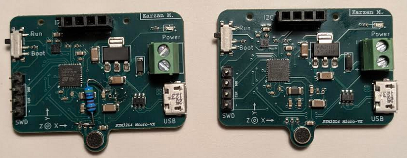

Some revision has been made to the PCB. 

The PCB is based on the original schematic for microphone. This works correctly with the Accelerometer project, however, not with the audio analyzer. For the latter, a resistor has to be desoldered and another added. This is mentioned in the microphone section in the schematic. 

Below is an image showing the crude modification to the left, and the original PCBA to the right.

