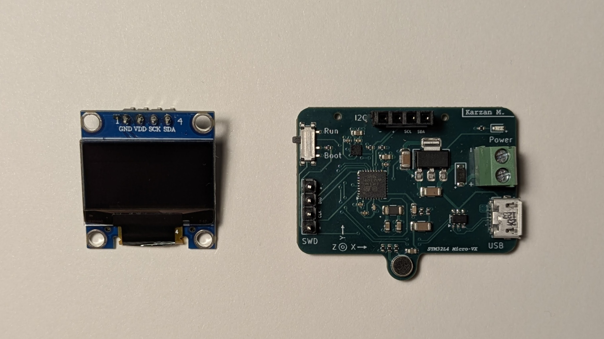
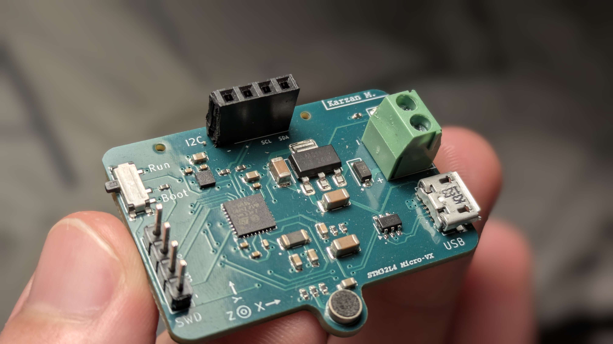

<h1 align="center"> Micro-VX: Mini Audio Visualizer </h1>

<i> Small portable STM32L4 based audio wave and FFT visualizer from MEMS microphone. This project started as an experiment to design my first PCB and explore the STM32L4 low-power MCU family. </i>

---

> This repository includes an extra project on the same board. The accelerometer visualization. That project was for expirementing with the module for future use. The main purpose for the board is for it to be used with the microphone, however a PCB error ment it had to be modified after assembly.
>

> Demo for expirimental Accelerometer Visualization:  
>
> Demo for FFT and Auido Wave Visualization: [Youtube Video Link](https://www.youtube.com/watch?v=JHZs5dUxs48)

  
  

---

### 1. Project structure

#### 1.1 Hardware

All Kicad source files for Schematic and PCB files are in the hardware folder. Also including Gerber files and footprint placement (assembly) for direct manufacturing, in this case JLCPCB. 

There are 2 versions of the PCB, with one being modified after assembly.

* **Accelerometer visualization:** 
Original PCB according to the schematic. Utilizing the Accelerometer (3-axis LIS2DW12) and I2C pin headers for OLED display (SSD1306).

* **Audio analyzer:**
Modified after assembly (refer to hardware folder). The PCB used for the audio analysis with MEMS microphone (B4013AM423-093). Also utilizes the I2C pin headers for OLED display (SSD1306) and a mechanical switch to change program state. 

#### 1.2 Firmware

In the firmware folder you will see 2 projects: 

* **The STM32L4-LIS2DW12-Visual project in the STM32L4-Accelerometer-Visual folder:**
Visualizer for the cheap accelerometer I added to the PCB. The program just shows the X, Y and Z axis as well as temperature. Another detail is to measure VDDA, this is very useful for sampling with ADC on battery powered devices. Ensuring accurate scaling. 

* **STM32L4-FW :**
The main project is this audio wave and FFT visualizer. Depending on the mechanical switch state (read from EXTI callback) it can either be showing continous audio wave or the FFT representation of it. Includes TIMER2 peripheral for triggering ADC to sample microphone, DMA double buffering, and I2C protocol for OLED display. The MCU was programmed with a ST-LINK V2, developed in STM32cubeIDE with HAL, and used the ARM cmsis library for DSP applications. 

### 2. Hardware Architecture
The PCB includes ESD protection and reverse polarity protection. Safe to use even if both battery and USB is connected because of the schottcky diode "OR", and the onboard LDO ensures a stable voltage for the STM32.  

Refer to the hardware folder for more specific information about the post assembly modification. 

The STM32L4 was chosen because it is from the low power series and also includes FPU and DSP. Not much flash memory is needed here so the 32 KB flash size was chosen. 

### 3. Firmware Architecture

#### 3.1 STM32L4-FW 

The firmware is rather simple. Timer2 TRGO initiate a conversion with a sample rate of 50 kHz. The ADC uses 8x oversampling with 1 bit shift to compensate low gain on hardware. DMA double buffer is used so wave visualizer does not have to wait for the whole fft buffer fill up and instead waits for the halv-transfer-complete flag. The FFT uses the ARM CMSIS library and all visual functionality in this project is scaled to the OLED.

Improvements could be made in terms of optimization and scaling, but that is outside the scope of this project.  

#### 3.2 STM32L4-LIS2DW12-Visual project 
Timer 2 triggers ADC injected group conversion, the callback function then stores the raw ADC value to a variable and sets a data ready flag

Timer 15 triggers normal ADC conversion, the callback function then stores the raw ADC value to a variable and sets a data ready flag

VDDA conversion just uses the last non zero value to calculate the voltage based on the formula from the datasheet. 

For the accelerometer the Data-Ready interrupt pin is connected to EXTI pin on microcontroller, when state changes on the pin the microcontroller notes this with a flag to later use in the superloop. 

